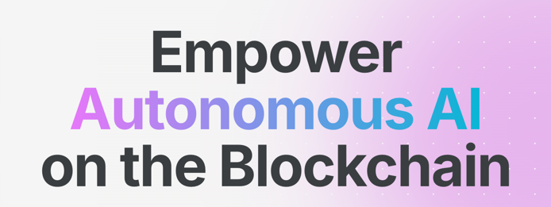

# 🧠 CreAItors

Create, deploy and interact with unstoppable and private AI Agents on Base.\
Powered
by [AgentKit](https://github.com/coinbase/agentkit) & [CDP solutions](https://www.coinbase.com/developer-platform), [Okto](https://okto.tech),
[Aleph Cloud](https://aleph.im) and [LibertAI](https://libertai.io) 🚀

  <h2>Made with ❤️ by</h2>

<table align="center">
  <tr>
    <td align="center">
      
       
      <a href="https://github.com/gmolki"><strong>Gerard</strong></a>
    </td>
    <td align="center">
      
       
      <a href="https://github.com/nesitor"><strong>Andres</strong></a>
    </td>
    <td align="center">
      
       
      <a href="https://github.com/RezaRahemtola"><strong>Reza</strong></a>
    </td>
  </tr>
</table>
